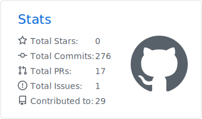

## Hi, I'm Ninad
IT undergrad at VIT Pune (2023–27), CGPA 8.76, originally from the U.S. and currently in India.

AI Agents · Backend systems · Embedded interfaces

#### Tech Stack

  
  
  
  
  
  
  
  

<picture>
  <source media="(prefers-color-scheme: dark)" srcset="./profile-summary-card-output/github_dark/3-stats.svg">
  <source media="(prefers-color-scheme: light)" srcset="./profile-summary-card-output/github/3-stats.svg">
  
</picture>
